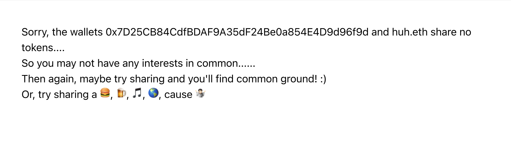
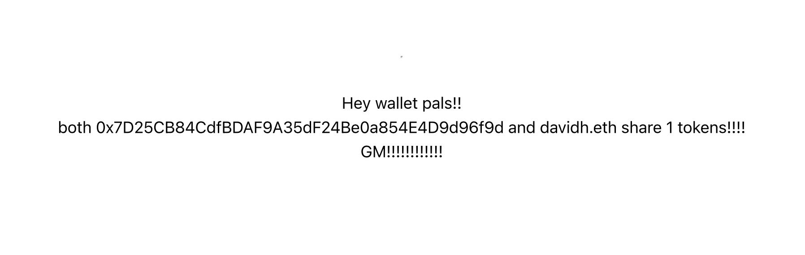
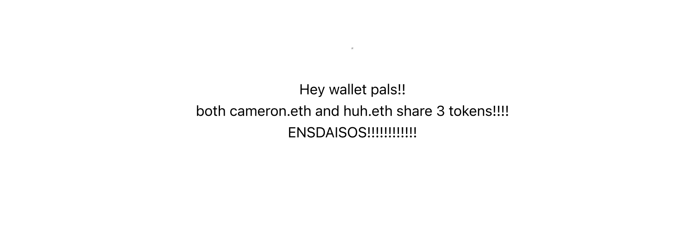

# wallet-pals

### Facebook shared likes for web 3.

Check two wallets for shared tokens. If you share tokens 🙌 you might share
interests 🍻 and you might be(come) friends 🚀

## Quickstart

Set wallets to check in `./pages/main.js/walletAddresses`

```bash
yarn install
yarn dev
```

Open a browser to http://localhost:3000/main

## Output Examples

No matches



One match



Many matches (PR to add delimiters welcome!)



## Contributing/forking

Contributions, comments, etc. welcome! This is an alpha proof of concept just to
see if it's fun or something more meaningful can be built on top.

See https://github.com/enxyz/wallet-pals
